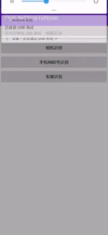

# RapidOcrAndroidOnnx

[](https://github.com/RapidAI/RapidOcrAndroidOnnx/issues)
[](https://github.com/RapidAI/RapidOcrAndroidOnnx)

<details open>
    <summary>目录</summary>

- [RapidOcrAndroidOnnx](#RapidOcrAndroidOnnx)
    - [联系方式](#联系方式)
    - [项目完整源码](#项目完整源码)
    - [APK下载](#APK下载)
    - [简介](#简介)
    - [总体说明](#总体说明)
    - [更新说明](#更新说明)
    - [编译说明](#编译说明)
        - [编译Release包](#编译Release包)
        - [重新编译](#重新编译)
    - [项目结构](#项目结构)
    - [常见问题](#常见问题)
        - [输入参数说明](#输入参数说明)
    - [关于作者](#关于作者)
    - [版权声明](#版权声明)
    - [示例图](#示例图)
        - [IMEI识别](#IMEI识别)
        - [身份证识别](#身份证识别)
        - [车牌识别](#车牌识别)

</details>

## 联系方式

* QQ群：887298230 或 [连接](https://jq.qq.com/?_wv=1027&k=P9b3olx6)

## 项目完整源码

* 整合好源码和依赖库的完整工程项目，文件比较大，可到Q群共享内下载，以Project开头的压缩包文件为源码工程，例：Project_RapidOcrAndroidOnnx-版本号.7z
* 如果想自己折腾，则请继续阅读本说明

## APK下载

* 编译好的demo apk，可以在release中下载，或者Q群共享内下载，文件名例：OcrLiteAndroidOnnx-版本号-release.apk

## 简介

RapidOcr onnxruntime推理 for Android

onnxruntime框架[https://github.com/microsoft/onnxruntime](https://github.com/microsoft/onnxruntime)

## 总体说明

1. 封装为独立的Library，可以编译为aar，作为模块来调用；
2. Native层以C++编写；
3. Demo App以Kotlin-JVM编写；
4. Android版与其它版本不同，包含了几个应用场景，包括相册识别、摄像头识别、手机IMEI号识别、摄像头身份证识别这几个功能页面；
5. opencv 3.4.15，使用了[opencv-mobile](https://github.com/nihui/opencv-mobile)的代码，编译脚本在script文件夹里；
6. onnxruntime动态库 1.6.0(因为当前模型不支持高版本)

## 更新说明
#### 2021-09-30 update 1.1.0

* opencv 3.4.15(特别说明：4.5.3也可以支持，如果换成cv4，minSdkVersion必须改为24)
* det模型更换为效果更好的ch_PP-OCRv2_det_infer
* 升级kotlin: 1.5.31
* 升级gradle: 7.0.2
* 升级各dependencies
* 使用kotlin coroutines代替rxjava

#### 2021-10-28 update 1.1.1

* 编辑build.gradle，把版本定义放到root build.gradle
* 编辑github workflow config，上传aar文件到release

#### 2022-03-03 update 1.1.2

* 升级gradle
* 升级各依赖库

## 编译说明

1. AndroidStudio 2021.2.1或以上；
2. NDK下载，在SDK Tools中下载，版本选最新版；
3. cmake 3.4.1或以上，最好是3.18.1，在SDK Tools中下载；
4. [模型下载](https://github.com/RapidAI/RapidOcrAndroidOnnx/releases/download/1.0.1/RapidOcrOnnxModel-20210930.7z)
* det模型用于分割文字块，有两种模型(server和mobile)，其中server体积大且较慢但效果好，mobile体积小且较快但效果差点。
* cls模型用于检测文字方向，只有一种模型
* rec模型用于文字识别，有两种模型(server和mobile)，其中server体积大且较慢但效果好，mobile体积小且较快但效果差点。
```
BaiPiaoOcrAndroidOnnx/OcrLibrary/src/main/assets
    ├── ch_ppocr_mobile_v2.0_cls_infer.onnx
    ├── ch_PP-OCRv2_det_infer.onnx det二选一，推荐
    ├── ch_ppocr_server_v2.0_det_infer.onnx det二选一
    ├── ch_ppocr_mobile_v2.0_rec_infer.onnx rec二选一，推荐
    ├── ch_ppocr_server_v2.0_rec_infer.onnx rec二选一
    └── ppocr_keys_v1.txt
```
* 代码中配置使用哪个模型
BaiPiaoOcrAndroidOnnx/OcrLibrary/src/main/java/com/benjaminwan/ocrlibrary/OcrEngine.kt，在init方法中配置：
```kotlin
val ret = init(
            context.assets, numThread,
            "ch_PP-OCRv2_det_infer.onnx",
            "ch_ppocr_mobile_v2.0_cls_infer.onnx",
            "ch_ppocr_mobile_v2.0_rec_infer.onnx",
            "ppocr_keys_v1.txt"
        )
```

5. 下载opencv-mobile-3.4.15-android.7z，[下载地址](https://gitee.com/benjaminwan/ocr-lite-android-ncnn/attach_files/843219/download/opencv-mobile-3.4.15-android.7z)
解压后目录结构为

```
OcrLiteAndroidNcnn/OcrLibrary/src/sdk
    └── native
        ├── jni
        └── staticlibs
```

6. 下载onnxruntime-1.6.0-android.7z，[下载地址](https://gitee.com/benjaminwan/ocr-lite-android-onnx/releases/v1.0.0.20201022)

* 解压后目录结构为
```
RapidOcrAndroidOnnx/OcrLibrary/src/main/onnx
├── ONNXConfig.cmake
├── arm64-v8a
│   └── libonnxruntime.so
├── armeabi-v7a
│   └── libonnxruntime.so
├── include
├── x86
│   └── libonnxruntime.so
└── x86_64
    └── libonnxruntime.so
```

7. 编译好的安装大约3xMB


### 编译Release包

* mac/linux使用命令编译```./gradlew assembleRelease```
* win使用命令编译```gradlew.bat assembleRelease```
* 输出apk文件在app/build/outputs/apk

### 重新编译

删除项目根目录下的如下缓存文件夹

```
.idea
build
app/build
OcrLibrary/.cxx
OcrLibrary/build
```

## 项目结构

```
OcrLiteAndroidOnnx
    ├── app               # demo app
    ├── capture           # 截图
    ├── common-aar        # app引用的aar库
    ├── keystore          # app签名密钥文件
    ├── OcrLibrary        # Ocr引擎库，包含Jni和C++代码
    └── scripts           # 编译脚本
```

## 常见问题

### 输入参数说明

请参考[OnnxCpp项目说明](https://github.com/RapidAI/RapidOCR/tree/main/cpp)

## 关于作者

* Android demo编写：[benjaminwan](https://github.com/benjaminwan)
* 模型来自：[PaddleOCR](https://github.com/PaddlePaddle/PaddleOCR)

## 版权声明

- OCR模型版权归[PaddleOCR](https://github.com/PaddlePaddle/PaddleOCR)所有；
- 其它工程代码版权归本仓库所有者所有；

## 示例图

#### IMEI识别


#### 身份证识别


#### 车牌识别



